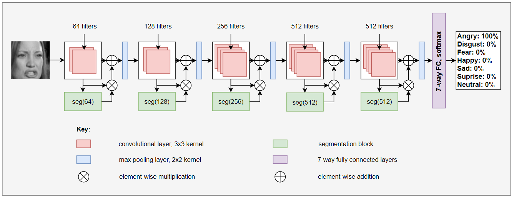

<div align="center">
  
# Segmentation-VGG 19

[](https://paperswithcode.com/sota/facial-expression-recognition-on-fer2013?p=a-novel-facial-emotion-recognition-model)
  
**_Published at [IJIT, Springer](https://www.springer.com/journal/41870) (Under Review)_**

---


  
---
  
</div align="center">

> This repository is the official implementation of 'A Novel Facial Emotion Recognition Model Using Segmentation VGG-19 Architecture'. 
  
## Requirements

To install requirements:

```setup
pip install -r requirements.txt
```

## Training and Evaluation

1. Clone the repository.
2. Download the dataset from this _[link](https://drive.google.com/drive/folders/1uK9znyGG7f56FTOQuOaBU_tov0A81Dal?usp=share_link)_ and put those files in the _fer_data_ folder.
3. Change the path of your file directories from the _config_ file and the _main.py_ file.
4. Run the _main.py_ file to train and evaluate the network.


## Results

Our model achieves SOTA performance on the FER2013 dataset
  
|            Model            |Top 1 Acc (%)|
|-----------------------------|-----------|
| CNN                         |   62.44   |
| AlexNet                     |   63.41   |
| GoogleNet                   |   65.20   |
| Human Accuracy              |   65 ± 5  |
| Deep Emotion                |   70.02   |
| EfficientNet                |   70.42   |
| Resnet18 (ARM)              |   71.38   |
| Inception                   |   71.60   |
| Inception-v1                |   71.85   |
| Ad-Corre                    |   72.03   |
| SE-Net50                    |   72.50   |
| Inception-v3                |   72.91   |
| DenseNet-121                |   73.16   |
| ResNet50                    |   73.20   |
| ResNet152                   |   73.27   |
| VGG                         |   73.28   |
| CNNs and BOVW + global SVM  |   73.25   |
| CBAM ResNet50               |   73.32   |
| ResNet34v2                  |   73.65   |
| LHC-NetC                    |   74.28   |
| LHC-Net                     |   74.42   |
| CNNs and BOVW + local SVM   |   75.42   |
|**Segmentation VGG-19**      | **75.97** |

## Contact
For any queries, feel free to contact at vignesh.nitt10@gmail.com.

## License
This project is open sourced under [MIT License](LICENSE).
